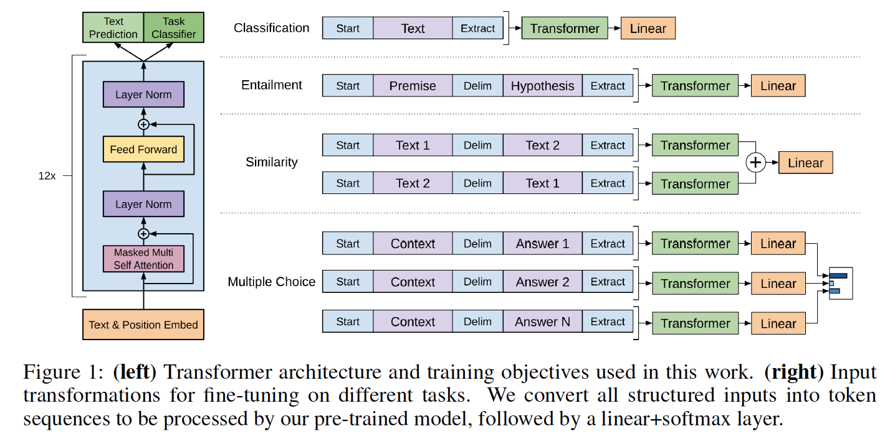

# PyTorch implementation of OpenAI's Finetuned Transformer Language Model

The code in this directory fully derives from the PyTorch port of the OpenAI transformer (that was originally written in TensorFlow) - the port was done by HuggingFace and [is available in its original form here](https://github.com/huggingface/pytorch-openai-transformer-lm).

This PyTorch implementation of the [TensorFlow code](https://github.com/openai/finetune-transformer-lm) is provided with OpenAI's paper ["Improving Language Understanding by Generative Pre-Training"](https://blog.openai.com/language-unsupervised/) by Alec Radford, Karthik Narasimhan, Tim Salimans and Ilya Sutskever.

This implementation comprises **a script to load in the PyTorch model the weights pre-trained by the authors** with the TensorFlow implementation.

The model classes and loading script are located in [model_pytorch.py](model_pytorch.py).

The names of the modules in the PyTorch model follow the names of the Variable in the TensorFlow implementation. This implementation tries to follow the original code as closely as possible to minimize the discrepancies.

This implementation thus also comprises a modified Adam optimization algorithm as used in OpenAI's paper with:
- fixed weights decay following the work of [Loshchilov et al.](https://arxiv.org/abs/1711.05101), and
- scheduled learning rate as [commonly used for Transformers](http://nlp.seas.harvard.edu/2018/04/03/attention.html#optimizer).

## Requirements
To use the model it-self by importing [model_pytorch.py](model_pytorch.py), you just need:
- PyTorch (version >=0.4)

To run the classifier training script in [train_veracity.py](train_veracity.py) you will need in addition:
- tqdm
- sklearn
- spacy
- ftfy
- pandas

You can download the weights of the OpenAI pre-trained version by cloning [Alec Radford's repo](https://github.com/openai/finetune-transformer-lm) and placing the `model` folder containing the pre-trained weights in the present repo.
